<div align="center">

# 🚀 Web Development Learning

[](https://github.com)
[](https://github.com)
[](https://github.com)

### *Engineering intelligent systems through progressive web development*

&nbsp;&nbsp;
&nbsp;&nbsp;
&nbsp;&nbsp;
&nbsp;&nbsp;


---

</div>

## **Mission Statement**

> **Building scalable, intelligent web applications that bridge classical computer science foundations with modern AI-driven architectures.**

This repository chronicles a systematic evolution from fundamental web technologies to enterprise-grade system design.
<br>

## 🏗️ **Technical Architecture**

```mermaid
graph TB
    A[🧠 Obsidian Vault] --> B[💻 Local Development]
    B --> C[🔧 GitHub Repository]
    C --> D[🚀 Production Deployment]
    
    A1[Conceptual Maps] --> A
    A2[Learning Notes] --> A
    A3[Architecture Plans] --> A
    
    B1[Code Practice] --> B
    B2[Experiments] --> B
    B3[Prototypes] --> B
    
    C1[Version Control] --> C
    C2[CI/CD Pipeline] --> C
    C3[Documentation] --> C
    
    D1[Live Applications] --> D
    D2[Performance Monitoring] --> D
    D3[User Feedback] --> D
```

<div align="center">



</div>

### 📋 **Development Roadmap**

<table>
<thead>
<tr>
<th>🏆 Phase</th>
<th>🎯 Objective</th>
<th>📦 Deliverable</th>
<th>⚡ Tech Stack</th>
<th>📅 Timeline</th>
</tr>
</thead>
<tbody>
<tr>
<td><b>Foundation</b></td>
<td>Core web mastery</td>
<td>Interactive components</td>
<td><code>HTML5</code> <code>CSS3</code> <code>Vanilla JS</code></td>
<td>Weeks 1-4</td>
</tr>
<tr>
<td><b>Framework</b></td>
<td>Modern patterns</td>
<td>Scalable SPAs</td>
<td><code>React</code> <code>Vue</code> <code>TypeScript</code></td>
<td>Weeks 5-12</td>
</tr>
<tr>
<td><b>Backend</b></td>
<td>Full-stack design</td>
<td>API platforms</td>
<td><code>Node.js</code> <code>Express</code> <code>MongoDB</code></td>
<td>Weeks 13-20</td>
</tr>
<tr>
<td><b>AI Integration</b></td>
<td>Intelligent systems</td>
<td>ML-powered apps</td>
<td><code>TensorFlow.js</code> <code>Python</code> <code>FastAPI</code></td>
<td>Weeks 21-28</td>
</tr>
<tr>
<td><b>Production</b></td>
<td>Enterprise deployment</td>
<td>Scalable systems</td>
<td><code>Docker</code> <code>AWS</code> <code>Kubernetes</code></td>
<td>Weeks 29-36</td>
</tr>
</tbody>
</table>

<br>

## 🚀 **Core Competencies**

<details>
<summary><b>🎨 Frontend Excellence</b></summary>

```yaml
Performance Optimization:
  - Sub-second load times
  - Efficient rendering pipelines
  - Code splitting & lazy loading
  - Image optimization strategies

Accessibility Engineering:
  - WCAG 2.1 AAA compliance
  - Screen reader compatibility
  - Keyboard navigation support
  - Color contrast optimization

Progressive Enhancement:
  - Mobile-first responsive design
  - Cross-browser compatibility
  - Offline functionality (PWA)
  - Performance budgets

State Management:
  - Redux/Zustand patterns
  - Context API optimization
  - Real-time data synchronization
  - Complex form handling
```

</details>

<details>
<summary><b>⚙️ Backend Systems</b></summary>

```yaml
API Architecture:
  - RESTful service design
  - GraphQL implementation
  - WebSocket real-time features
  - API versioning strategies

Database Design:
  - Relational (PostgreSQL)
  - NoSQL (MongoDB, Redis)
  - Query optimization
  - Caching strategies

Microservices:
  - Service mesh architecture
  - Container orchestration
  - Event-driven patterns
  - Distributed system design

Security:
  - JWT authentication
  - OAuth 2.0 implementation
  - Data encryption
  - Vulnerability assessment
```

</details>

<details>
<summary><b>🤖 AI/ML Integration</b></summary>

```yaml
Model Deployment:
  - Edge computing solutions
  - Serverless inference
  - Model versioning
  - A/B testing frameworks

Real-time Processing:
  - Computer vision pipelines
  - Natural language processing
  - Predictive analytics
  - Stream processing

Data Visualization:
  - Interactive dashboards
  - D3.js implementations
  - Real-time charts
  - Engineering simulations

Performance Monitoring:
  - ML-driven optimization
  - Anomaly detection
  - Predictive scaling
  - User behavior analysis
```

</details>

<br>

## 📊 **Progress Metrics**


## **Strategic Roadmap**

<table>
<tr>
<td width="33%">

### 🎯 **Short-term** (3-6 months)
- Master fundamental web technologies
- Build responsive, accessible interfaces
- Implement modern JavaScript patterns
- Create first full-stack application
- Establish development workflows

</td>
<td width="33%">

### 🚀 **Medium-term** (6-12 months)
- Deploy production applications
- Integrate AI/ML capabilities
- Master advanced React patterns
- Implement real-time features
- Build comprehensive test suites

</td>
<td width="33%">

### 🌟 **Long-term** (12+ months)
- Architect enterprise systems
- Lead technical initiatives
- Contribute to open source
- Mentor other developers
- Pioneer innovative solutions

</td>
</tr>
</table>

---

<div align="center">

*"The best way to predict the future is to engineer it."*  
**— Alan Kay**

---

</div>
